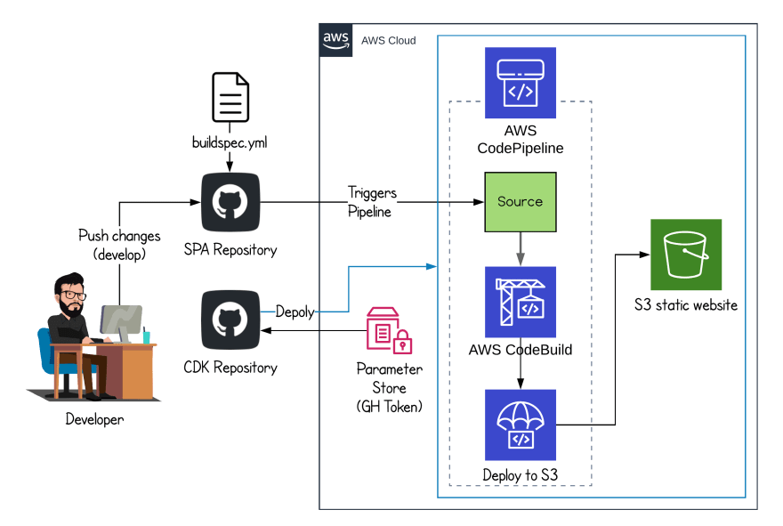

# SOURCE
[CDK](https://github.com/aws/aws-cdk)

# HOW

# REF
[Build AWS Systems Manager Automation runbooks using AWS CDK](https://aws.amazon.com/blogs/mt/build-aws-systems-manager-automation-runbooks-using-aws-cdk/)

[An unexpected security group rule](https://docs.aws.amazon.com/cdk/api/v2/docs/aws-cdk-lib.aws_ec2.InterfaceVpcEndpoint.html)