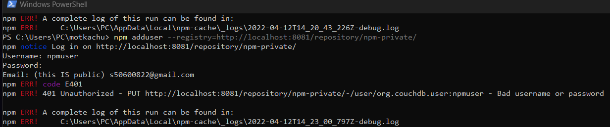
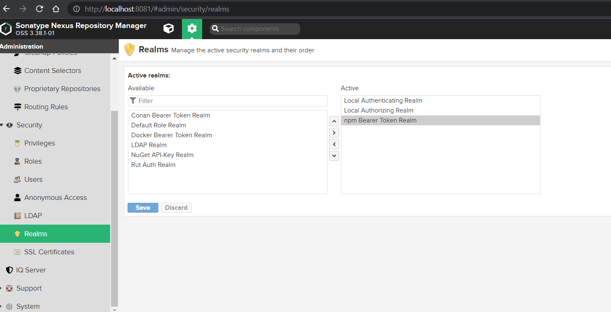
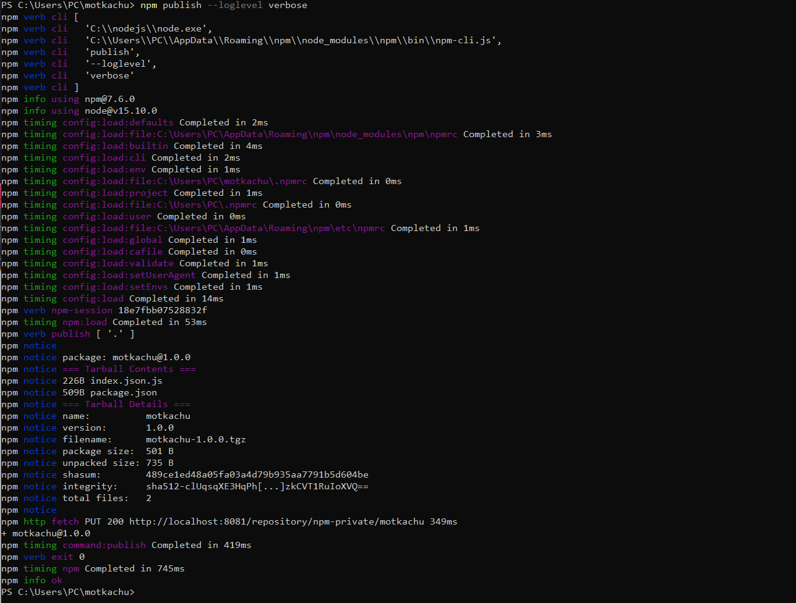

start a Nexus
```bash
docker run --rm -it -p 8081:8081/tcp sonatype/nexus3:latest
```

create a user for example `npmuser`, active
create a private registry then:
```bash
npm config set registry http://localhost:8081/repository/npm-private/
npm login --registry=http://localhost:8081/repository/npm-private/
```

First try - expecting Auth err


Add NPM Token Realm


Try again. Should be sorted
