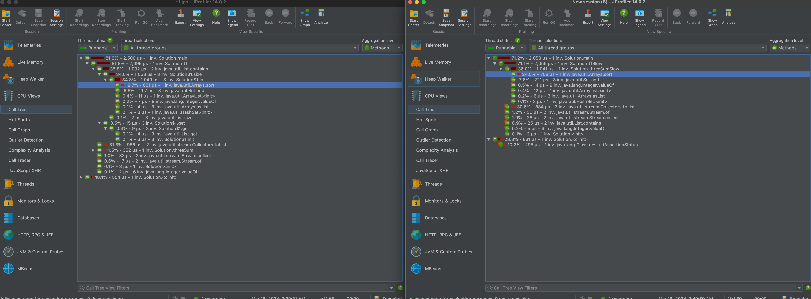

## fastest
```java
    private List<List<Integer>> res;

    public List<List<Integer>> threeSum(int[] nums) {

        return new AbstractList<List<Integer>>() {
            public List<Integer> get(int index) {
                init();
                return res.get(index);
            }

            public int size() {
                init();
                return res.size();
            }

            private void init() {
                if (res != null)
                    return;
                Arrays.sort(nums);
                int l, r, sum;
                final Set<List<Integer>> tempRes = new HashSet<>();
                for (int i = 0; i < nums.length - 2; ++i) {
                    l = i + 1;
                    r = nums.length - 1;
                    while (l < r) {
                        sum = nums[i] + nums[l] + nums[r];
                        if (sum == 0)
                            tempRes.add(Arrays.asList(nums[i], nums[l], nums[r]));
                        if (sum < 0)
                            ++l;
                        else
                            --r;
                    }
                }
                res = new ArrayList<List<Integer>>(tempRes);
            }

        };
    }
```


## slower
```java
    public List<List<Integer>> threeSumSlow(int[] nums) {
        if (nums == null || nums.length == 0)
            return Collections.emptyList();
        Arrays.sort(nums);
        int l, r, sum;
        final Set<List<Integer>> tempRes = new HashSet<>();
        for (int i = 0; i < nums.length - 2; ++i) {
            l = i + 1;
            r = nums.length - 1;
            while (l < r) {
                sum = nums[i] + nums[l] + nums[r];
                if (sum == 0)
                    tempRes.add(Arrays.asList(nums[i], nums[l], nums[r]));
                if (sum < 0)
                    ++l;
                else
                    --r;
            }
        }
        return new ArrayList<List<Integer>>(tempRes);
    }
```


